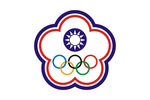

# Flag-css

CSS for SVG country flags with PNG fallback. See the [demo](http://7kfpun.github.io/flag-css/).

> As a backend developer, I prefer **ISO_3166-1 alpha-3**.

  - All flags from [Wikimedia](http://commons.wikimedia.org/wiki/Category:SVG_sovereign_state_flags)
  - Use [ISO 3166-1](http://en.wikipedia.org/wiki/ISO_3166-1), all alpha-2, alpha-3 and numeric are supported
  - [IOC](https://en.wikipedia.org/wiki/List_of_IOC_country_codes) and [FIFA](https://en.wikipedia.org/wiki/List_of_FIFA_country_codes) are also supported
  - Respect flag's original ratio
  - Flag-css CSS, LESS, and Sass files are licensed under the MIT License

## install

    bower:

        bower install --save flag-css

## Usage

For using the flags inline with text add the classes `.flag` with `.flag-xxx` or `.flag-xx` (where `xxx` is the
[ISO 3166-1-alpha-3](http://en.wikipedia.org/wiki/ISO_3166-1_alpha-2) or [ISO 3166-1-numeric](http://en.wikipedia.org/wiki/ISO_3166-1_numeric) and xx is the [ISO 3166-1-alpha-2](http://en.wikipedia.org/wiki/ISO_3166-1_alpha-2) of a country) to an empty ``. Or using `flag-ioc-xxx` or `flag-fifa-xxx` (where `xxx` either the [IOC](https://en.wikipedia.org/wiki/List_of_IOC_country_codes) or [FIFA](https://en.wikipedia.org/wiki/List_of_FIFA_country_codes) of a country). Example:

    
    
    
    
    

### Sizing

    
    
    
                      ⋮
                      ⋮
    

### Rotating and flipping

    
    
    
    
    

## Flag list

| Flag                   | Alpha 3 | Alpha 2 | Numeric | IOC | FIFA |
| ---------------------- |:-------:|:-------:|:-------:|:---:|:----:|
|  | abw | aw | 533 | aru | aru |
|  | afg | af | 4 | afg | afg |
|  | ago | ao | 24 | ang | ang |
|  | aia | ai | 660 | aia | aia |
|  | ala | ax | 248 |  | ald |
|  | alb | al | 8 | alb | alb |
|  | and | ad | 20 | and | and |
|  | are | ae | 784 | uae | uae |
|  | arg | ar | 32 | arg | arg |
|  | arm | am | 51 | arm | arm |
|  | asm | as | 16 | asa | asa |
|  | ata | aq | 10 |  | ros |
|  | atf | tf | 260 |  |  |
|  | atg | ag | 28 | ant | atg |
|  | aus | au | 36 | aus | aus |
|  | aut | at | 40 | aut | aut |
|  | aze | az | 31 | aze | aze |
|  | bdi | bi | 108 | bdi | bdi |
|  | bel | be | 56 | bel | bel |
|  | ben | bj | 204 | ben | ben |
|  | bes | bq | 535 | aho | ant |
|  | bfa | bf | 854 | bur | bfa |
|  | bgd | bd | 50 | ban | ban |
|  | bgr | bg | 100 | bul | bul |
|  | bhr | bh | 48 | brn | bhr |
|  | bhs | bs | 44 | bah | bah |
|  | bih | ba | 70 | bih | bih |
|  | blm | bl | 652 |  |  |
|  | blr | by | 112 | blr | blr |
|  | blz | bz | 84 | biz | blz |
|  | bmu | bm | 60 | ber | ber |
|  | bol | bo | 68 | bol | bol |
|  | bra | br | 76 | bra | bra |
|  | brb | bb | 52 | bar | brb |
|  | brn | bn | 96 | bru | bru |
|  | btn | bt | 64 | bhu | bhu |
|  | bvt | bv | 74 |  |  |
|  | bwa | bw | 72 | bot | bot |
|  | caf | cf | 140 | caf | cta |
|  | can | ca | 124 | can | can |
|  | cck | cc | 166 |  | cck |
|  | che | ch | 756 | sui | sui |
|  | chl | cl | 152 | chi | chi |
|  | chn | cn | 156 | chn | chn |
|  | civ | ci | 384 | civ | civ |
|  | cmr | cm | 120 | cmr | cmr |
|  | cod | cd | 180 | cod | cod |
|  | cog | cg | 178 | cgo | cgo |
|  | cok | ck | 184 | cok | cok |
|  | col | co | 170 | col | col |
|  | com | km | 174 | com | com |
|  | cpv | cv | 132 | cpv | cpv |
|  | cri | cr | 188 | crc | crc |
|  | cub | cu | 192 | cub | cub |
|  | cuw | cw | 531 |  |  |
|  | cxr | cx | 162 |  | cxr |
|  | cym | ky | 136 | cay | cay |
|  | cyp | cy | 196 | cyp | cyp |
|  | cze | cz | 203 | cze | cze |
|  | deu | de | 276 | ger | ger |
|  | dji | dj | 262 | dji | dji |
|  | dma | dm | 212 | dma | dma |
|  | dnk | dk | 208 | den | den |
|  | dom | do | 214 | dom | dom |
|  | dza | dz | 12 | alg | alg |
|  | ecu | ec | 218 | ecu | ecu |
|  | egy | eg | 818 | egy | egy |
|  | eri | er | 232 | eri | eri |
|  | esh | eh | 732 |  | sah |
|  | esp | es | 724 | esp | esp |
|  | est | ee | 233 | est | est |
|  | eth | et | 231 | eth | eth |
|  | fin | fi | 246 | fin | fin |
|  | fji | fj | 242 | fij | fij |
|  | flk | fk | 238 | flk | flk |
|  | fra | fr | 250 | fra | fra |
|  | fro | fo | 234 | far | fro |
|  | fsm | fm | 583 | fsm | fsm |
|  | gab | ga | 266 | gab | gab |
|  | gbr | gb | 826 | gbr |  |
|  | geo | ge | 268 | geo | geo |
|  | ggy | gg | 831 |  | gbg |
|  | gha | gh | 288 | gha | gha |
|  | gib | gi | 292 | gib | gbz |
|  | gin | gn | 324 | gui | gui |
|  | glp | gp | 312 | gud | glp |
|  | gmb | gm | 270 | gam | gam |
|  | gnb | gw | 624 | gbs | gnb |
|  | gnq | gq | 226 | geq | eqg |
|  | grc | gr | 300 | gre | gre |
|  | grd | gd | 308 | grn | grn |
|  | grl | gl | 304 | grl | grl |
|  | gtm | gt | 320 | gua | gua |
|  | guf | gf | 254 | fgu | guf |
|  | gum | gu | 316 | gum | gum |
|  | guy | gy | 328 | guy | guy |
|  | hkg | hk | 344 | hkg | hkg |
|  | hmd | hm | 334 |  |  |
|  | hnd | hn | 340 | hon | hon |
|  | hrv | hr | 191 | cro | cro |
|  | hti | ht | 332 | hai | hai |
|  | hun | hu | 348 | hun | hun |
|  | idn | id | 360 | ina | idn |
|  | imn | im | 833 |  | gbm |
|  | ind | in | 356 | ind | ind |
|  | iot | io | 86 |  |  |
|  | irl | ie | 372 | irl | irl |
|  | irn | ir | 364 | iri | irn |
|  | irq | iq | 368 | irq | irq |
|  | isl | is | 352 | isl | isl |
|  | isr | il | 376 | isr | isr |
|  | ita | it | 380 | ita | ita |
|  | jam | jm | 388 | jam | jam |
|  | jey | je | 832 |  | gbj |
|  | jor | jo | 400 | jor | jor |
|  | jpn | jp | 392 | jpn | jpn |
|  | kaz | kz | 398 | kaz | kaz |
|  | ken | ke | 404 | ken | ken |
|  | kgz | kg | 417 | kgz | kgz |
|  | khm | kh | 116 | cam | cam |
|  | kir | ki | 296 | kir | kir |
|  | kna | kn | 659 | skn | skn |
|  | kor | kr | 410 | kor | kor |
|  | kwt | kw | 414 | kuw | kuw |
|  | lao | la | 418 | lao | lao |
|  | lbn | lb | 422 | lib | lib |
|  | lbr | lr | 430 | lbr | lbr |
|  | lby | ly | 434 | lba | lby |
|  | lca | lc | 662 | lca | lca |
|  | lie | li | 438 | lie | lie |
|  | lka | lk | 144 | sri | sri |
|  | lso | ls | 426 | les | les |
|  | ltu | lt | 440 | ltu | ltu |
|  | lux | lu | 442 | lux | lux |
|  | lva | lv | 428 | lat | lva |
|  | mac | mo | 446 | mac | mac |
|  | maf | mf | 663 |  |  |
|  | mar | ma | 504 | mar | mar |
|  | mco | mc | 492 | mon | mon |
|  | mda | md | 498 | mda | mda |
|  | mdg | mg | 450 | mad | mad |
|  | mdv | mv | 462 | mdv | mdv |
|  | mex | mx | 484 | mex | mex |
|  | mhl | mh | 584 | msh | mhl |
|  | mkd | mk | 807 | mkd | mkd |
|  | mli | ml | 466 | mli | mli |
|  | mlt | mt | 470 | mlt | mlt |
|  | mmr | mm | 104 | mya | mya |
|  | mne | me | 499 | mgo | mne |
|  | mng | mn | 496 | mgl | mng |
|  | mnp | mp | 580 | nma | nmi |
|  | moz | mz | 508 | moz | moz |
|  | mrt | mr | 478 | mtn | mtn |
|  | msr | ms | 500 | mnt | msr |
|  | mtq | mq | 474 | mrt | mtq |
|  | mus | mu | 480 | mri | mri |
|  | mwi | mw | 454 | maw | mwi |
|  | mys | my | 458 | mas | mas |
|  | myt | yt | 175 | may | myt |
|  | nam | na | 516 | nam | nam |
|  | ncl | nc | 540 | ncd | ncl |
|  | ner | ne | 562 | nig | nig |
|  | nfk | nf | 574 | nfi | nfk |
|  | nga | ng | 566 | ngr | nga |
|  | nic | ni | 558 | nca | nca |
|  | niu | nu | 570 | niu | niu |
|  | nld | nl | 528 | ned | ned |
|  | nor | no | 578 | nor | nor |
|  | npl | np | 524 | nep | nep |
|  | nru | nr | 520 | nru | nru |
|  | nzl | nz | 554 | nzl | nzl |
|  | omn | om | 512 | oma | oma |
|  | pak | pk | 586 | pak | pak |
|  | pan | pa | 591 | pan | pan |
|  | pcn | pn | 612 |  | pcn |
|  | per | pe | 604 | per | per |
|  | phl | ph | 608 | phi | phi |
|  | plw | pw | 585 | plw | plw |
|  | png | pg | 598 | png | png |
|  | pol | pl | 616 | pol | pol |
|  | pri | pr | 630 | pur | pur |
|  | prk | kp | 408 | prk | prk |
|  | prt | pt | 620 | por | por |
|  | pry | py | 600 | par | par |
|  | pse | ps | 275 | ple | ple |
|  | pyf | pf | 258 | fpo | tah2 |
|  | qat | qa | 634 | qat | qat |
|  | reu | re | 638 | reu | reu |
|  | rou | ro | 642 | rou | rou |
|  | rus | ru | 643 | rus | rus |
|  | rwa | rw | 646 | rwa | rwa |
|  | sau | sa | 682 | ksa | ksa |
|  | sdn | sd | 729 | sud | sud |
|  | sen | sn | 686 | sen | sen |
|  | sgp | sg | 702 | sin | sin |
|  | sgs | gs | 239 |  |  |
|  | shn | sh | 654 | hel | shn |
|  | sjm | sj | 744 |  |  |
|  | slb | sb | 90 | sol | sol |
|  | sle | sl | 694 | sle | sle |
|  | slv | sv | 222 | esa | slv |
|  | smr | sm | 674 | smr | smr |
|  | som | so | 706 | som | som |
|  | spm | pm | 666 | spm | spm |
|  | srb | rs | 688 | srb | srb |
|  | ssd | ss | 728 |  |  |
|  | stp | st | 678 | stp | stp |
|  | sur | sr | 740 | sur | sur |
|  | svk | sk | 703 | svk | svk |
|  | svn | si | 705 | slo | svn |
|  | swe | se | 752 | swe | swe |
|  | swz | sz | 748 | swz | swz |
|  | sxm | sx | 534 |  |  |
|  | syc | sc | 690 | sey | sey |
|  | syr | sy | 760 | syr | syr |
|  | tca | tc | 796 | tks | tca |
|  | tcd | td | 148 | cha | cha |
|  | tgo | tg | 768 | tog | tog |
|  | tha | th | 764 | tha | tha |
|  | tjk | tj | 762 | tjk | tjk |
|  | tkl | tk | 772 |  | tkl |
|  | tkm | tm | 795 | tkm | tkm |
|  | tls | tl | 626 | tls | tls |
|  | ton | to | 776 | tga | tga |
|  |  |  |  | tpe | tpe |
|  | tto | tt | 780 | tto | tri |
|  | tun | tn | 788 | tun | tun |
|  | tur | tr | 792 | tur | tur |
|  | tuv | tv | 798 | tuv | tuv |
|  | twn | tw | 158 |  |  |
|  | tza | tz | 834 | tan | tan |
|  | uga | ug | 800 | uga | uga |
|  | ukr | ua | 804 | ukr | ukr |
|  | umi | um | 581 |  |  |
|  | ury | uy | 858 | uru | uru |
|  | usa | us | 840 | usa | usa |
|  | uzb | uz | 860 | uzb | uzb |
|  | vat | va | 336 |  | vat |
|  | vct | vc | 670 | vin | vin |
|  | ven | ve | 862 | ven | ven |
|  | vgb | vg | 92 | ivb | vgb |
|  | vir | vi | 850 | isv | vir |
|  | vnm | vn | 704 | vie | vie |
|  | vut | vu | 548 | van | van |
|  | wlf | wf | 876 | waf | wlf |
|  | wsm | ws | 882 | sam | sam |
|  | yem | ye | 887 | yem | yem |
|  | zaf | za | 710 | rsa | rsa |
|  | zmb | zm | 894 | zam | zam |
|  | zwe | zw | 716 | zim | zim |

## Todo's

  - 3×4 flag ratio available

## License

MIT

## Development

Ubuntu:

    apt-get install imagemagick
    apt-get install graphicsmagick

Mac OS X (using Homebrew):

    brew install imagemagick
    brew install graphicsmagick
